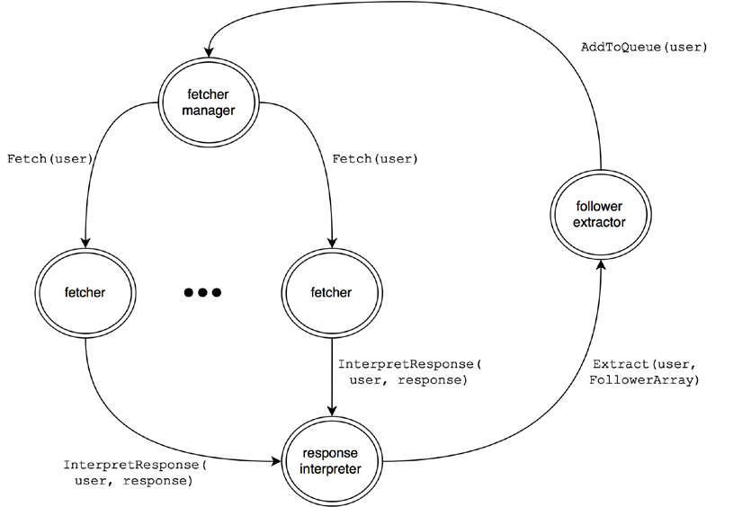

# Github Crawler

This project, implements crawling from Github repositories by using Akka actors and by starting from a base user continuing until specified depth parameter.

## Configuration Parameters:

- **token** : github limits unauthorized requests for 60 requests per hour for an IP. This limitation could be exceeded to 5000 requests per hour for an authorized user. This is possible with the token parameters which you should take it from your profile setting.
- **depth:** This number decides how many layer of followers do you want to application to fetch.
- **future_mode:** Fetchers would fetch faster by wrapping up the future concept in the actor model. Set it as true for faster mode.
- **n_fetchers:** number of fetcher actors
- **n_parsers**: number of parser actors
- **n_extractors**: number of extractor actors

## Proposed Actor Model:

## Inferences

* Future would make the actor fetching procedure faster but it's dangerous in "Accessing the sender of a message"
* Providing multiple actors for parsers and extractors(n_parser>1, n_extractors>1) has wrong result in some runs.
* Providing multiple actors for parsers and extractors(n_parser>1, n_extractors>1) would not speedup even if the result is right.
* Increasing the number of fetches(n_fetcher) would speedup but is goes to saturation state after number around 16
* When future mode is on, increasing n_fetchers is not affecting on speedup 

## TODO:

* Push the extracted relations into Neo4j Database
* Error handling in fetcher actor
* Monitor actors activities via visualization and metrics
* Throughput concept should be added to code 

